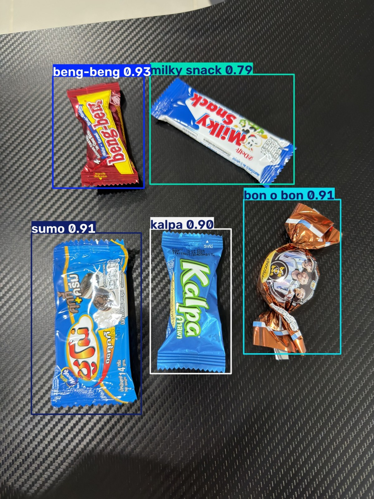
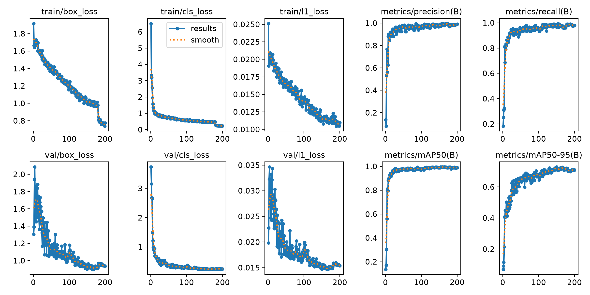
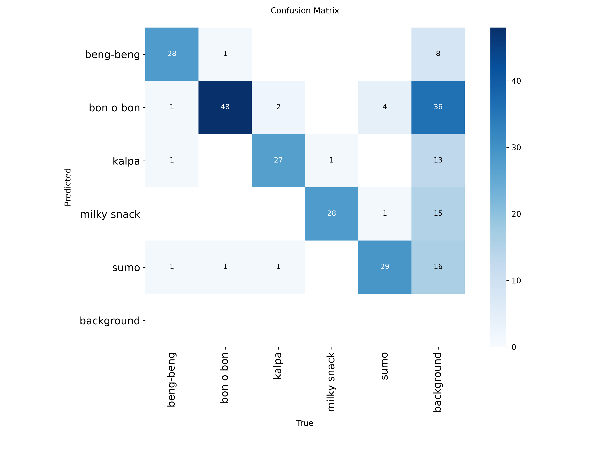
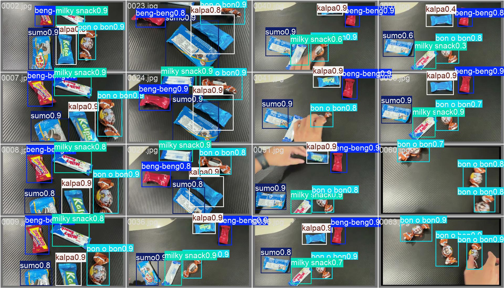
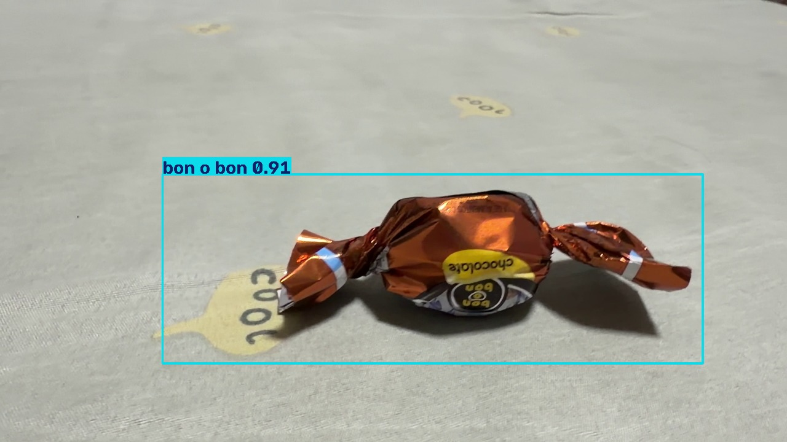
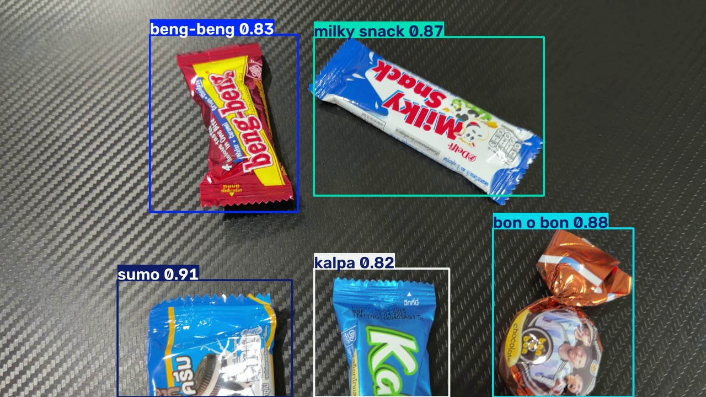

# AI_YOLO_Chocolate_treats

โปรเจกต์ตรวจจับและจำแนกขนมช็อกโกแลต 5 ยี่ห้อด้วย **YOLO26** จากภาพ วิดีโอ และกล้องแบบ Real-time โดยใช้ **Ultralytics YOLO** ร่วมกับ **Label Studio** สำหรับสร้าง Dataset และตีกรอบ Bounding Box

| Class | ยี่ห้อ |
| ----- | ----- |
| 0 | `beng-beng` |
| 1 | `bon o bon` |
| 2 | `kalpa` |
| 3 | `milky snack` |
| 4 | `sumo` |



---

## 📂 Project Structure

```text
AI_YOLO_Chocolate_treats/
├── README.md
├── requirements.txt
├── env/                          # Virtual Environment (ไม่ได้อัปขึ้น GitHub)
├── frame/
│   └── images/                   # เฟรมที่แยกจากวิดีโอ ใช้ทำ Label
├── dataset/                      # สร้างโดย 01-export_dataset.py
│   ├── images/{train,val}/
│   ├── labels/{train,val}/
│   ├── classes.txt
│   └── data.yaml
├── runs/detect/                  # ผลการ Train และ Predict ของ Ultralytics
├── project-4-at-...json          # ไฟล์ Export จาก Label Studio
├── yolo26s.pt                    # Pre-trained model ที่ใช้เริ่ม Train
│
├── 01-export_dataset.py          # แปลง Label Studio JSON -> YOLO Dataset
├── 02-train.py                   # Train โมเดล
├── 03-test_image.py              # ทดสอบกับรูปภาพ
├── 04-test_video.py              # ทดสอบกับวิดีโอ
└── 05-test-camera.py             # ทดสอบกับกล้อง Webcam แบบ Real-time
```

> ไฟล์วิดีโอ รูปทดสอบ Dataset และ Weights มีขนาดใหญ่ จึงไม่ได้อัปขึ้น GitHub

---

# ⚙️ Installation

ทดสอบบน **Windows + Python 3.13 + NVIDIA GPU (CUDA 12.8)**

## 1. Clone Project

```bash
git clone https://github.com/Chanasorn179/ai_yolo_chocolate_treats.git
cd ai_yolo_chocolate_treats
```

## 2. สร้างและ Activate Virtual Environment

### Windows (Command Prompt)

```cmd
py -3.13 -m venv env
env\Scripts\activate.bat
```

### Windows (PowerShell)

```powershell
py -3.13 -m venv env
env\Scripts\Activate.ps1
```

### macOS / Linux

```bash
python3 -m venv env
source env/bin/activate
```

เมื่อ Activate สำเร็จ จะเห็นชื่อ `(env)` นำหน้าบรรทัดคำสั่ง

## 3. ติดตั้ง Dependencies

```bash
python -m pip install --upgrade pip
pip install -r requirements.txt
```

`requirements.txt` ติดตั้งทุกอย่างในครั้งเดียว ได้แก่

| Package | เวอร์ชัน |
| ------- | ------- |
| `torch` / `torchvision` / `torchaudio` | 2.11.0 / 0.26.0 / 2.11.0 (CUDA 12.8) |
| `ultralytics` | 8.4.115 |
| `label-studio` | 1.23.0 |
| `lap` | 0.5.13 (ใช้กับ Tracking ใน `05-test-camera.py`) |
| `opencv-python`, `numpy`, `pillow`, `matplotlib`, `PyYAML`, `tqdm` | ล่าสุด |

> ถ้าใช้ CPU หรือ macOS ให้ลบบรรทัด `--extra-index-url` และ `+cu128` ออกจาก `requirements.txt` แล้วเปลี่ยน `device=0` ในสคริปต์เป็น `device="cpu"` (หรือ `"mps"` บน Mac)

ตรวจสอบว่า PyTorch เห็น GPU:

```bash
python -c "import torch; print(torch.cuda.is_available(), torch.cuda.get_device_name(0))"
```

---

# 🎞️ Extract Frame จาก Video

ติดตั้ง ffmpeg ก่อน (ปิดแล้วเปิด cmd ใหม่หลังติดตั้ง)

```bash
winget install ffmpeg
```

แยกเฟรมจากวิดีโอ Train ไปไว้ใน `frame/images/`

```bash
mkdir frame\images
ffmpeg -i train_chocolate_treats.mp4 -vf fps=2 frame/images/%04d.jpg
```

| คำสั่ง | รายละเอียด |
| ----- | --------- |
| `ffmpeg -i train_chocolate_treats.mp4` | ไฟล์วิดีโอต้นฉบับ |
| `-vf fps=2` | ดึงภาพ 2 เฟรมต่อวินาที (ปรับได้) |
| `frame/images/%04d.jpg` | บันทึกเป็น `0001.jpg`, `0002.jpg`, ... |

ถ้าวิดีโอเป็น 4K หรือต้องการเพิ่มวิดีโอใหม่เข้า Dataset เดิม ให้ย่อขนาดเป็น 1920x1080 และ **ตั้งชื่อนำหน้าให้ไม่ซ้ำกับเฟรมเดิม** เพราะสคริปต์ Export จับคู่รูปด้วยชื่อไฟล์

```bash
ffmpeg -i "bon o bon.mp4.MOV" -vf "fps=2,scale=1920:1080" frame/images/bonobon_%04d.jpg
```

---

# 🖼️ Label ด้วย Label Studio

## 1. เปิด Label Studio

เปิด Command Prompt อีกหน้าต่าง Activate env แล้วเปิดโหมดเสิร์ฟไฟล์ในเครื่อง **ก่อน** รัน Label Studio ทุกครั้ง

```cmd
env\Scripts\activate.bat
set LABEL_STUDIO_LOCAL_FILES_SERVING_ENABLED=true
set LABEL_STUDIO_LOCAL_FILES_DOCUMENT_ROOT=E:\mini_project_ai_yolo\AI_YOLO_Chocolate_treats
label-studio start
```

> เปลี่ยน `LABEL_STUDIO_LOCAL_FILES_DOCUMENT_ROOT` เป็น path ของโฟลเดอร์โปรเจกต์ในเครื่องตัวเอง (โฟลเดอร์ที่มี `frame/` อยู่)
>
> คำสั่ง `set` มีผลแค่ใน cmd หน้าต่างนั้น ถ้าลืมตั้งค่า รูปจะขึ้น error "เกิดปัญหาในการโหลด URL"
>
> หน้าต่าง cmd ที่รัน Label Studio ต้องเปิดค้างไว้ ***ห้ามปิด***

ระบบจะเปิด `http://localhost:8080` ครั้งแรกต้อง Sign Up (ใช้อีเมลอะไรก็ได้ แต่ต้องจำไว้ใช้ครั้งถัดไป)

## 2. สร้าง Project

1. กด **Create Project** แล้วตั้งชื่อ
2. ข้ามขั้น Data Import ไปก่อน
3. ที่ **Labeling Setup** เลือก **Object Detection with Bounding Boxes**
4. เปลี่ยนจาก Visual เป็น **Code** แล้ววางโค้ดนี้แทนของเดิม

```xml
<View>
  <Image name="image" value="$image"/>
  <RectangleLabels name="label" toName="image">
    <Label value="beng-beng" background="#E53935"/>
    <Label value="kalpa" background="#1E88E5"/>
    <Label value="sumo" background="#43A047"/>
    <Label value="milky snack" background="#FDD835"/>
    <Label value="bon o bon" background="#8E24AA"/>
  </RectangleLabels>
</View>
```

> ชื่อ Label ต้องสะกดให้ตรงกันทุกครั้ง Class ID เรียงตามตัวอักษรของชื่อ Label การเพิ่ม Label ใหม่อาจทำให้ ID เดิมเลื่อน และใช้กับ Weights เก่าไม่ได้

## 3. เชื่อมต่อรูปภาพ (Local Storage)

1. ไปที่ **Settings → Cloud Storage → Add Source Storage** เลือก **Local files**
2. **Absolute local path** ใส่ path เต็มของโฟลเดอร์รูป เช่น `E:\mini_project_ai_yolo\AI_YOLO_Chocolate_treats\frame\images`
3. เปิด **Treat every bucket object as a source file** แล้วกด **Check Connection**
4. กด **Add Storage** แล้ว **Sync**

> แนะนำให้นำรูปเข้าผ่าน Local Storage แทนการลากวาง (Drag & Drop) เพราะการลากวางจะคัดลอกรูปไปไว้ในโฟลเดอร์ของ Label Studio และเติมรหัสนำหน้าชื่อไฟล์ เช่น `35051e9f-bonobon_0001.jpg` (`01-export_dataset.py` รองรับกรณีนี้แล้ว แต่ต้องมีรูปชื่อเดิมอยู่ใน `frame/images/`)

## 4. ตีกรอบ Bounding Box

เลือกภาพ แล้วลากกรอบครอบขนมแต่ละชิ้น ใช้คีย์ลัดเลือก Class ได้

```text
1 → beng-beng   2 → kalpa   3 → sumo   4 → milky snack   5 → bon o bon
```

เสร็จแต่ละภาพกด **Submit** รองรับกรอบแบบหมุน (Rotated Rectangle) ด้วย สคริปต์ Export จะแปลงเป็นกรอบตรงที่ครอบมุมทั้ง 4 ให้อัตโนมัติ

## 5. Export Annotation

1. กลับไปหน้า Project
2. กด **Export** แล้วเลือก **JSON**
3. นำไฟล์ `.json` ที่ได้มาวางไว้ในโฟลเดอร์โปรเจกต์

---

# 🔄 Convert Label Studio JSON → YOLO Dataset

```bash
python 01-export_dataset.py
```

สคริปต์จะหาไฟล์ `*.json` ในโฟลเดอร์โปรเจกต์ให้เอง (ต้องมีแค่ **1 ไฟล์**) ถ้ามีหลายไฟล์ให้ระบุเอง

```bash
python 01-export_dataset.py --json project-4-at-2026-10-04-webcam-merged.json
```

> `project-4-at-2026-10-04-webcam-merged.json` คือไฟล์ Export จาก Label Studio รวมกับ Label ของภาพ Webcam 28 ภาพ (`frame/webcam_tasks.json` ซึ่ง Import เข้า Label Studio ได้)

| Option | ค่าเริ่มต้น | รายละเอียด |
| ------ | --------- | --------- |
| `--json` | ไฟล์ `.json` ไฟล์เดียวในโฟลเดอร์ | ไฟล์ Export จาก Label Studio |
| `--images-dir` | `frame/images` | โฟลเดอร์รูปต้นฉบับ |
| `--output-dir` | `dataset` | โฟลเดอร์ Dataset ที่จะสร้าง |
| `--train-split` | `0.8` | สัดส่วน Train (ที่เหลือเป็น Validation) |
| `--seed` | `42` | ค่าสุ่มสำหรับแบ่ง Train/Val ให้ได้ผลเหมือนเดิมทุกครั้ง |

> สคริปต์จะ **ลบ** `dataset/images` และ `dataset/labels` เดิมทุกครั้งก่อนสร้างใหม่ และสร้าง `dataset/data.yaml` กับ `dataset/classes.txt` ให้อัตโนมัติ

ผลลัพธ์ที่ได้:

```text
Classes (5): ['beng-beng', 'bon o bon', 'kalpa', 'milky snack', 'sumo']
Train: 205 images
Val:   51 images
```

---

# 🧠 Train YOLO26

```bash
python 02-train.py
```

| ค่า | ตั้งไว้ | หมายเหตุ |
| --- | ------ | ------- |
| Model | `yolo26s.pt` | รุ่น s ตีกรอบแม่นกว่ารุ่น n |
| Epochs | 200 | หยุดเองถ้า 60 epoch ติดกันไม่ดีขึ้น (`patience=60`) |
| Image Size | 640 | |
| Batch | 16 | |
| Optimizer | `MuSGD` + `cos_lr=True` | |
| Device | `0` (GPU) | |

Data Augmentation เพิ่มเติม เพราะวิดีโอ Train ถ่ายจากมุมเดียว

```text
degrees      = 15.0    # หมุนภาพ ±15 องศา
shear        = 5.0     # บิดภาพเฉียง
perspective  = 0.001   # จำลองมุมกล้องที่ต่างออกไป
fliplr       = 0.5     # พลิกซ้าย-ขวา
flipud       = 0.0     # ไม่พลิกบน-ล่าง
mosaic       = 1.0
mixup        = 0.1
close_mosaic = 20      # ปิด Mosaic ใน 20 epoch สุดท้าย
```

ผลแต่ละรอบจะถูกบันทึกไว้ที่ `runs/detect/train-N/` โดย Weights ที่ดีที่สุดอยู่ที่ `runs/detect/train-N/weights/best.pt`



---

# 📊 Results

โมเดลปัจจุบันคือ `runs/detect/train-4` (yolo26s) เทรนครบ 200 epoch โดย `best.pt` มาจาก epoch 150 Dataset มีทั้งหมด 256 ภาพ ได้แก่
- เฟรมจากวิดีโอ Train เดิม 147 ภาพ
- เฟรมจากวิดีโอ bon o bon (ระยะใกล้ หลายมุม) 81 ภาพ
- ภาพจากกล้อง Webcam บนโต๊ะไม้ 28 ภาพ (`cam_*.jpg`) ถ่ายเพิ่มเพราะ `train-3` ใช้กับกล้องจริงแล้วทายผิด

## ผลรายยี่ห้อ (Validation 51 ภาพ)

| Class | Precision | Recall | mAP50 | mAP50-95 |
| ----- | --------- | ------ | ----- | -------- |
| beng-beng | 1.000 | 0.976 | 0.995 | 0.696 |
| bon o bon | 0.930 | 0.980 | 0.969 | 0.683 |
| kalpa | 1.000 | 0.983 | 0.995 | 0.770 |
| milky snack | 0.995 | 0.897 | 0.992 | 0.716 |
| sumo | 1.000 | 1.000 | 0.995 | 0.777 |
| **all** | **0.985** | **0.967** | **0.989** | **0.728** |

## ปัญหาของ `train-3` กับกล้อง Webcam

ภาพ Train ของ `train-3` ถ่ายจากมือถือบนพื้นคาร์บอนสีดำทั้งหมด พอใช้กับกล้อง Webcam บนโต๊ะไม้ที่แสงจ้า โมเดลจึงทายผิด

* ไม่เจอ beng-beng ซองสีเหลืองเลย เพราะใน Dataset มีแต่ซองฟอยล์สีแดง
* ทาย milky snack เป็น sumo
* ทายพื้นกระเบื้องและหน้าต่างเป็น kalpa
* ชื่อยี่ห้อกระพริบสลับไปมาระหว่างเฟรม

ผลเทียบบนภาพ Webcam 27 ภาพที่ไม่ได้ใช้ Train (conf 0.5)

| Model | beng-beng | milky snack | kalpa | sumo | bon o bon | ทายผิดนอกโต๊ะ |
| ----- | --------- | ----------- | ----- | ---- | --------- | ------------- |
| `train-4` | **27/27** | **27/27** | 27/27 | 27/27 | 25/27 | **0 กรอบ** |
| `train-3` | 0/27 | 0/27 (ทายเป็น sumo) | 27/27 | 27/27 | 27/27 | 20 กรอบ |

> ภาพ Webcam ทุกภาพถ่ายฉากเดียวกัน ขนมวางเรียงลำดับเดิม ถ้าสลับตำแหน่งหรือเปลี่ยนแสงอาจยังทายผิดได้ ควรถ่ายเพิ่มด้วยปุ่ม `s` ใน `05-test-camera.py`

## เทียบกับโมเดลรุ่นก่อน

| Model | val mAP50 | val mAP50-95 | วิดีโอ bon o bon (เฟรมที่ตรวจเจอ) | `test.jpg` (conf 0.5) |
| ----- | --------- | ------------ | --------------------------------- | --------------------- |
| `train-4` | 0.989 | 0.728 | **93%** (1225/1317) | ครบ 5/5 ยี่ห้อ |
| `train-3` | 0.971 | 0.614 | 93% (1221/1317) | ครบ 5/5 ยี่ห้อ |
| `train-v2` | 0.970 | 0.599 | 38% (506/1317) | 4/5 (sumo ได้แค่ 0.33) |

> ตัวเลข val ของ `train-4` วัดบน Validation 51 ภาพ (มีภาพ Webcam รวมอยู่ด้วย) ส่วน `train-3` และ `train-v2` วัดบน 46 ภาพเดิม จึงเทียบกันตรง ๆ ไม่ได้ วิดีโอ bon o bon มี 81 เฟรมที่ใช้ Train อยู่ด้วย ตัวเลข 93% จึงสูงกว่าการใช้งานจริงเล็กน้อย







> ภาพ Validation มาจากวิดีโอชุดเดียวกับภาพ Train ถ้าจะให้โมเดลใช้งานได้ดีกับฉากจริง ควรถ่ายวิดีโอเพิ่มสำหรับทุกยี่ห้อ บนพื้นหลังและระยะที่หลากหลาย

---

# 🧪 Test Model

ทั้ง 3 สคริปต์โหลด Weights จาก `runs/detect/train-4/weights/best.pt` ถ้า Train รอบใหม่ ให้แก้ path นี้ในทั้ง 3 ไฟล์

## 1. Test Image

```bash
python 03-test_image.py
```

ทดสอบกับ `test.jpg` ที่ `conf=0.5` แก้ชื่อไฟล์ได้ในสคริปต์

```python
results = model.predict("test.jpg", conf=0.5, save=True)
```


## 2. Test Video

```bash
python 04-test_video.py
```

ทดสอบกับ `test_chocolate_treats_video.mp4` แสดงผลระหว่างประมวลผลและบันทึกวิดีโอผลลัพธ์ไว้ที่ `runs/detect/predict-N/`

```python
video_to_test = "test_chocolate_treats_video.mp4"
```



## 3. Test Camera

```bash
python 05-test-camera.py
```

เปิดกล้อง Webcam (DirectShow, 1280x720 MJPG) และตรวจจับแบบ Real-time

| ปุ่ม | การทำงาน |
| --- | ------- |
| `q` | ออกจากโปรแกรม |
| `s` | บันทึกภาพดิบ (ไม่มีกรอบ) ลง `frame/images/cam_XXXX.jpg` เพื่อนำไป Label แล้ว Train เพิ่ม |

สคริปต์ใช้ `model.track()` ให้ขนมชิ้นเดิมได้ id เดิมในทุกเฟรม แล้วโหวต Class จาก 15 เฟรมล่าสุดโดยถ่วงน้ำหนักด้วย confidence ชื่อยี่ห้อจึงไม่กระพริบเมื่อโมเดลทายผิดเป็นบางเฟรม ปรับจำนวนเฟรมได้ที่ `VOTE_FRAMES` (การ Tracking ต้องใช้แพ็กเกจ `lap` ซึ่งอยู่ใน `requirements.txt` แล้ว)

## ใช้ผ่าน Ultralytics CLI

```bash
yolo detect predict model=runs/detect/train-4/weights/best.pt source=test.jpg conf=0.5
```

---

# ⚠️ Notes

* รันทุกสคริปต์จากโฟลเดอร์โปรเจกต์ เพราะ path ทั้งหมดเป็นแบบ relative
* `01-export_dataset.py` ต้องมีไฟล์ JSON แค่ไฟล์เดียวในโฟลเดอร์ หรือระบุด้วย `--json`
* รูปใน `frame/images/` ต้องมีชื่อตรงกับรูปใน JSON
* ถ้าเปลี่ยนรายชื่อ Label ต้อง Train ใหม่ทั้งหมด เพราะ Class ID อาจเลื่อน
* Training และ Camera ตั้ง `device=0` (GPU) ไว้ ถ้าไม่มี GPU ให้เปลี่ยนเป็น `device="cpu"`
* ถ้า cmd ขึ้น `'label-studio' is not recognized` แปลว่ายังไม่ได้ Activate env
